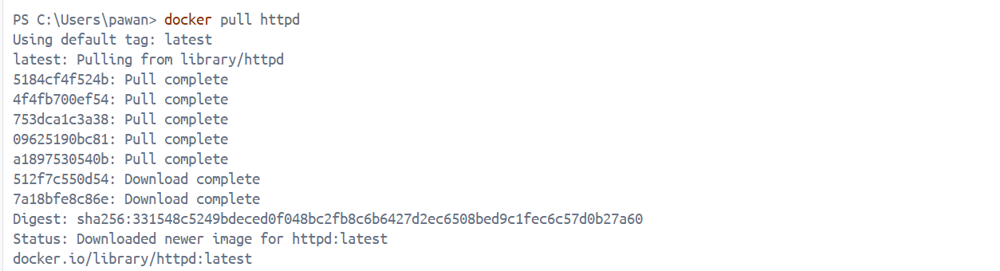
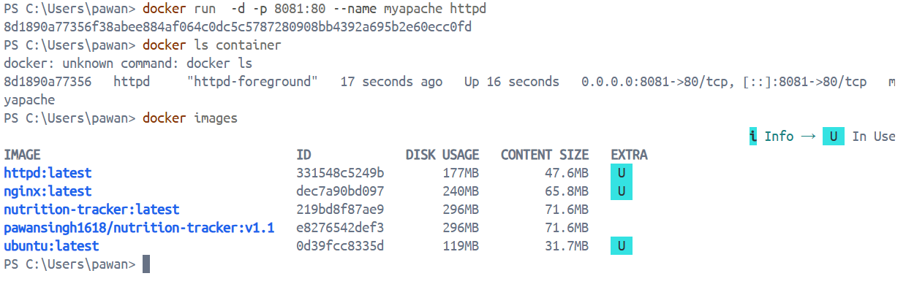
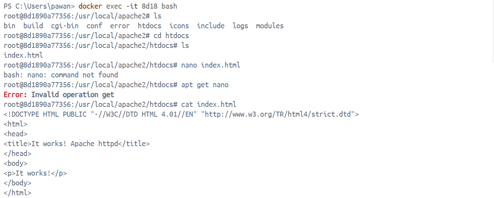
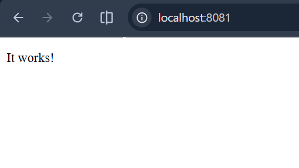
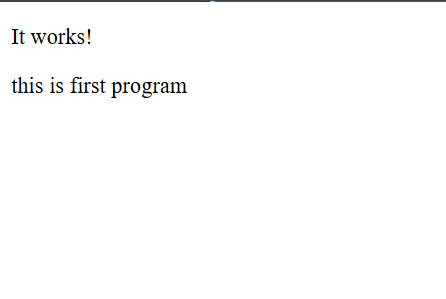

# Apache Docker Task

---

## 🔹 1. Pull Apache (httpd) Image

```bash
docker pull httpd
📸 Output:



🔹 2. Verify Image Downloaded
docker images

👉 Look for:

REPOSITORY   TAG     IMAGE ID
httpd        latest  xxxx
📸 Output:


🔹 3. Run Container with Name + Port Mapping
docker run -d -p 8081:80 --name myapache httpd
📸 Output:


🔹 4. Check Running Containers
docker ps

👉 You should see:

CONTAINER ID   IMAGE   PORTS
xxxx           httpd   0.0.0.0:8081->80/tcp
📸 Output:


🔹 5. Access Apache in Browser

Open in browser:

http://localhost:8081

👉 You should see:


It works!
📸 Output:


✅ Task Completed

